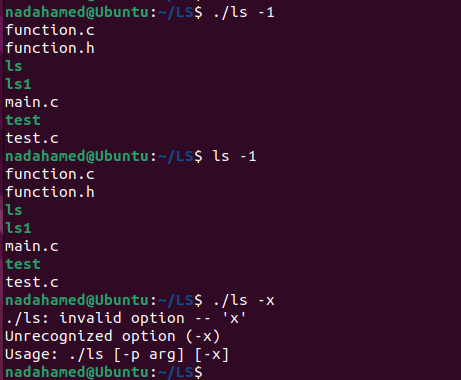
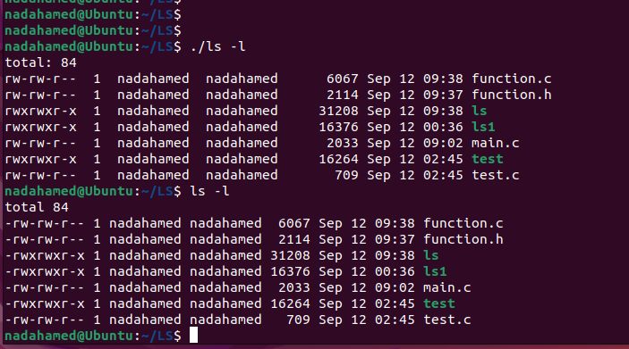
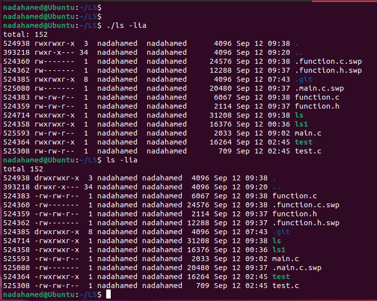

# `ls` Command Implementation

## Overview

This project implements a custom version of the `ls` command in C, supporting the following options:

- `-l` : Long format listing.
- `-a` : Show all files, including hidden files.
- `-t` : Sort by time of last modification.
- `-u` : Sort by access time.
- `-c` : Sort by creation time.
- `-i` : Show inode numbers.
- `-f` : Do not sort; list files as they are encountered.
- `-d` : List directories themselves, not their contents.
- `-1` : List one file per line.

The command supports listing the contents of one or more directories and organizes the output in a table format.

## Files

- `main.c` : Contains the main function that processes command-line arguments and invokes the necessary functions.
- `function.c` : Contains the implementation of the various functionalities for the `ls` command.
- `function.h` : Header file defining the function prototypes and macros.

## Features

- **Long Format (`-l`)**: Displays detailed information about each file.
- **Show All (`-a`)**: Includes hidden files (files starting with a dot).
- **Sort by Time (`-t`, `-u`, `-c`)**: Options to sort files by modification time, access time, or creation time.
- **Show Inode (`-i`)**: Displays the inode number of each file.
- **No Sort (`-f`)**: Lists files in the order they are found.
- **List Directories Only (`-d`)**: Lists directories themselves rather than their contents.
- **One File per Line (`-1`)**: Outputs one file per line.

## Results

- **ls -1**:
  


- **ls -l**:
  


- **ls -lia**:
  



## Compilation

To compile the project, use the following `gcc` command:

```sh
gcc -o ls main.c function.c
