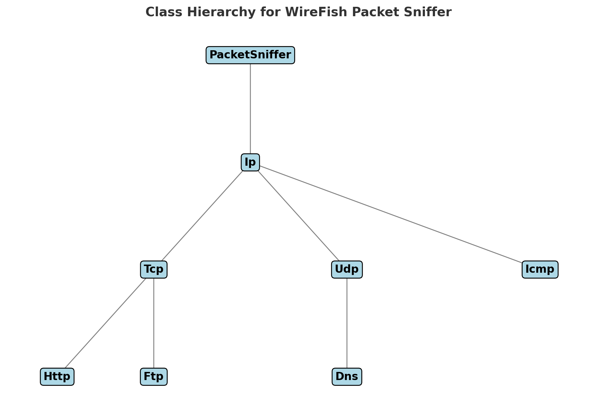

# WireFish - Packet Sniffer in C++

## Introduction
WireFish is a packet sniffer written in **C++** that applies **Object-Oriented Programming (OOP) principles**. It captures network packets, extracts headers, and analyzes **IP, TCP, UDP, ICMP**, and **application layer protocols (HTTP, DNS, FTP)**.

## Features
- **Written in C++ using OOP** (Inheritance and Polymorphism)
- **Captures and processes network packets**
- **Supports multi-level protocol processing:**
  - **IP Layer:** Extracts IP headers and directs to transport layer.
  - **Transport Layer:** Handles TCP, UDP, and ICMP packets.
  - **Application Layer:** Extracts HTTP, DNS, and FTP data.
- **Supports filtering of specific IP/Port using command-line options**
- **Expandable design for additional protocol analysis**

## Class Hierarchy
The following **OOP structure** has been used for implementing WireFish:



### Class Breakdown
- **`PacketSniffer` (Base Class)** - Captures raw packets using `libpcap`.
- **`Ip` (Derived from `PacketSniffer`)** - Extracts IP packet headers.
- **`Tcp`, `Udp`, `Icmp` (Derived from `Ip`)** - Handles transport layer protocols.
- **`Http` (Derived from `Tcp`)** - Extracts HTTP request data.
- **`Dns` (Derived from `Udp`)** - Extracts DNS query information.
- **`Ftp` (Derived from `Tcp`)** - Extracts FTP command data.

## Installation and Compilation
### Requirements
- **C++ Compiler (`g++`)**
- **Libpcap (`sudo apt install libpcap-dev`)**

### Compile the Sniffer
```sh
g++ -o packet_sniffer PacketSniffer.cpp Ip.cpp Tcp.cpp Udp.cpp Http.cpp Dns.cpp Ftp.cpp main.cpp -lpcap
```

### Run the Sniffer
```sh
sudo ./packet_sniffer
```
*Note: Running as root (`sudo`) is required to capture network traffic.*


## Code Explanation
### `Http.cpp` (Extracts HTTP Data)
- Captures **plain-text HTTP requests**.
- Extracts **GET/POST requests** from packets.

### `Dns.cpp` (Extracts DNS Data)
- Captures **DNS query names** from packets.
- Extracts requested domains (e.g., `www.google.com`).

### `Ftp.cpp` (Extracts FTP Commands)
- Captures **FTP control messages (USER, PASS, LIST, etc.)**.
- Extracts credentials if sent in plaintext.


