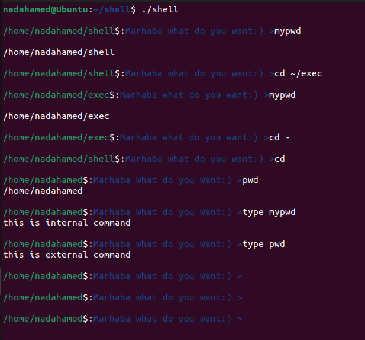
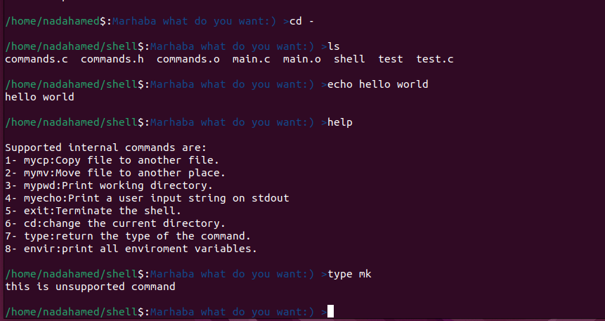
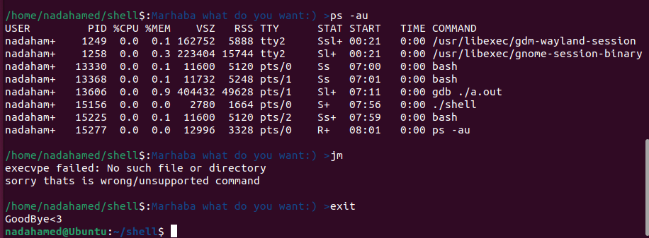

# Shell Project

This project implements a custom shell that supports a variety of built-in and external commands. It provides functionality for executing commands, managing directories, and handling environment variables.

## Files

- `main.c`: Contains the main function which checks the input command and calls the appropriate function from `commands.c`.
- `commands.c`: Contains the implementation of the functions used to run commands.
- `commands.h`: Header file declaring the functions defined in `commands.c`.
  
## Features

### Built-in Commands

- `mycp` : Copy files or directories (replaces `cp`).
- `mymv` : Move or rename files or directories (replaces `mv`).
- `mypwd` : Print the current working directory (replaces `pwd`).
- `myecho` : Echo text to the standard output (replaces `echo`).
- `help` : Display help information.
- `exit` : Exit the shell.
- `cd path` : Change the current directory.
- `type command` : Return the type of the command (`internal`, `external`, or `unsupported`).
- `envir` : Print all environment variables (same as `env`).  

### External Commands

- Execute programs using their names directly (without needing to specify the full path).
- Commands are executed with dynamically allocated argument lists, ensuring flexibility and no memory leaks.
- Proper memory management is implemented to handle allocated resources efficiently.
- pipe feature is also supported you can try:
  ```sh
  pstree | less

## Example Output

Here is an example of the shell output:









## Building and Running

To build the shell, use the following command:

```sh
gcc -o shell main.c commands.c


